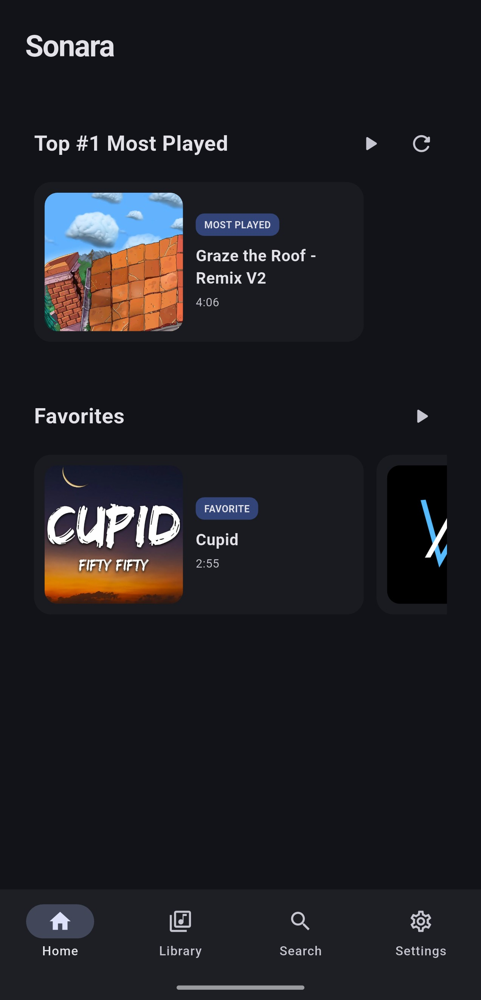
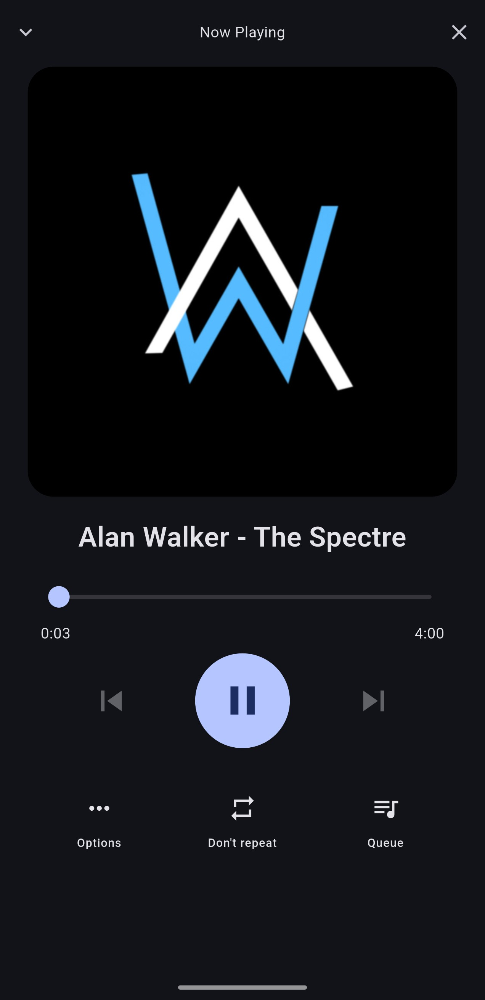
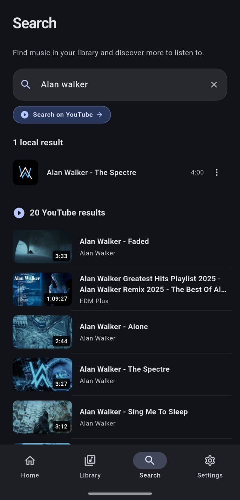
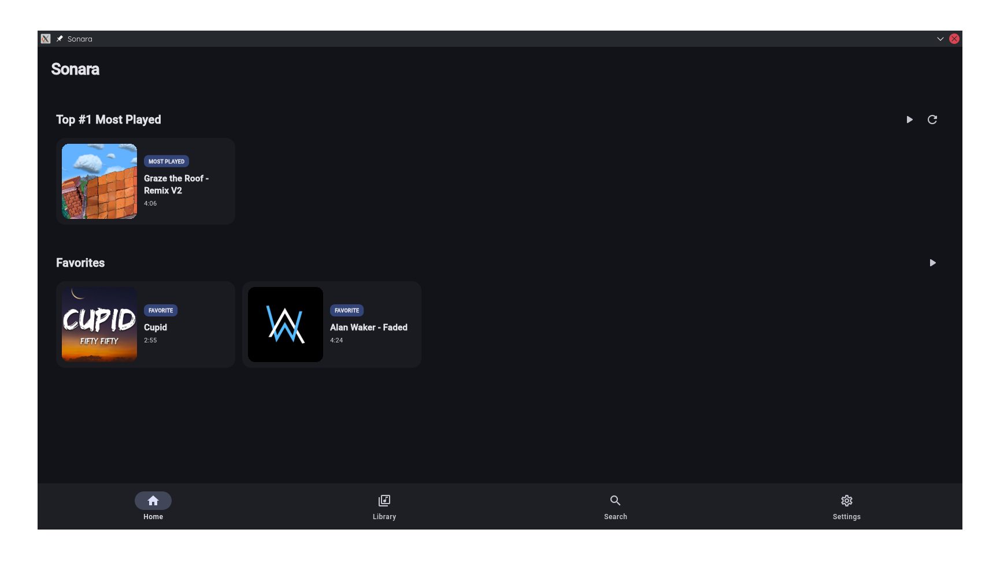
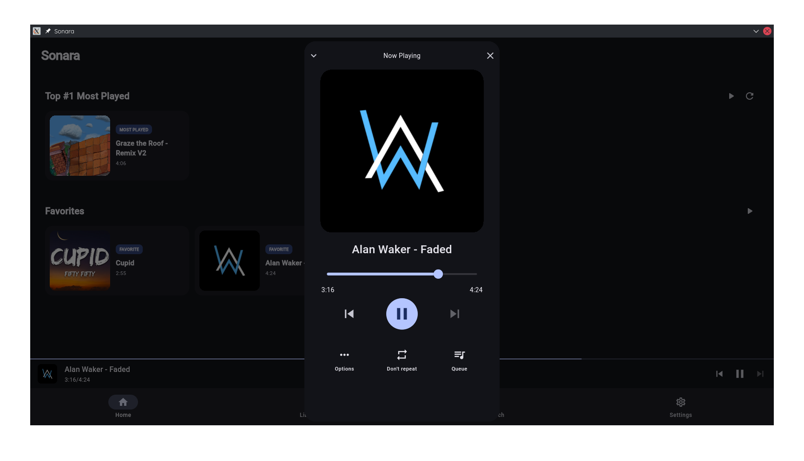

# Sonara 🎵

**Sonara** is a modern and customizable music player built with **Flutter**, focused on providing a simple and complete experience for managing and playing local music.

It supports music libraries, playlists, favorites, metadata, album artwork, YouTube search, downloads, and Android media controls.

## 📸 Screenshots

### Android

<p align="center">
  
  
  
</p>

### Linux / Desktop

<p align="center">
  
  
</p>

## ✨ Features

* 🎵 Local music playback.
* 📚 Music library organized by:

  * Songs
  * Albums
  * Artists
  * Playlists
  * Favorites
* 🔎 Universal music search.
* ▶️ Queue and playback management.
* 🔀 Shuffle and repeat modes.
* 🎚️ Configurable crossfade between tracks.
* 🔊 ReplayGain support when available.
* ❤️ Favorites system.
* 📋 Playlist creation and management.
* 🖼️ Album artwork and metadata support.
* 📥 Audio downloads from supported links.
* ▶️ YouTube search and integration.
* 📱 Android media controls, including lock-screen and system media controls.
* 🎨 Customizable color themes.
* 🌙 Light and dark themes.
* 🌐 Multi-language support.
* 💾 Persistent settings and library data.

## 📱 Platforms

Sonara currently focuses on:

* **Android**
* **Linux**

Some features may vary depending on the platform.

## 🛠️ Built With

Sonara is primarily built using:

* **Flutter**
* **Dart**
* **just_audio**
* **just_audio_background**
* **Provider**
* **MediaKit**
* **SharedPreferences**
* **FFmpeg**
* Native Android APIs through `MethodChannel`

## 🚀 Getting Started

### Requirements

* Flutter SDK
* Dart SDK
* Android Studio or the required Android development tools for Android development
* An Android device/emulator for Android development
* `mpv` and `libmpv-dev` for Linux

### Clone the repository

```bash
git clone https://github.com/WarycoeDev/sonara.git
cd sonara
```

### Install dependencies

```bash
flutter pub get
```

### Linux dependencies

On Debian/Ubuntu-based distributions, install the required dependencies:

```bash
sudo apt install mpv libmpv-dev
```

### Run the application

```bash
flutter run
```

## 📦 Build Android APK

To build a release APK:

```bash
flutter build apk --release
```

The generated APK will be located at:

```text
build/app/outputs/flutter-apk/app-release.apk
```

## 🐧 Build Sonara for Linux

To build the Linux release:

```bash
flutter build linux --release
```

The generated application will be located in:

```text
build/linux/x64/release/bundle/
```

### 📦 Package Sonara as a `.deb`

To create a Debian package, install Flutter Distributor:

```bash
dart pub global activate flutter_distributor
```

Add the Dart global binaries to your `PATH`:

```bash
export PATH="$PATH:$HOME/.pub-cache/bin"
```

Then package Sonara as a `.deb`:

```bash
fastforge package --platform linux --targets deb
```

## 🎯 Project Goals

Sonara aims to be a **simple, customizable, and feature-rich music player** focused primarily on the user's own music library.

The project is designed to provide a modern music experience without requiring a traditional music streaming service to manage and enjoy a local collection.

Sonara is actively being developed, and new features and improvements may be added over time.

## 📄 License

Sonara is currently under development. Licensing and distribution information will be added when applicable.
